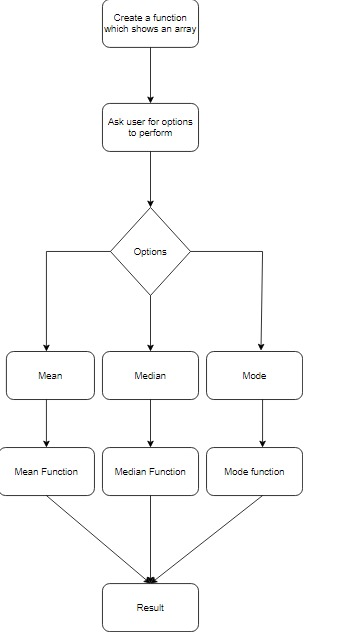

Given task is to create an array using function concept and perform certain task.

1. Mean function is been created which gives mean value of the array.
2. Median function is been created which gives median value of the array.
3. Mode function is been created which gives mode value of the array.
4. Now the main function is been created which contains the array and options that has to be performed.

The output is like:

1st the user will be asked the length of the array then the value will be asked to entered and the options will be asked which should be performed.

For Mean:
Enter the length of the array: 
6
Enter value for array:
11
Enter value for array:
2
Enter value for array:
1
Enter value for array:
3
Enter value for array:
45
Enter value for array:
33
11 2 1 3 45 33

Options to perform
1.Mean
2.Median
3.Mode
1
Mean is: 15

For Median:
Enter the length of the array: 
6
Enter value for array:
11
Enter value for array:
3
Enter value for array:
2
Enter value for array:
1
Enter value for array:
54
Enter value for array:
11 3 2 1 54 34

Options to perform
1.Mean
2.Median
3.Mode
2
The sorted array is:

1 2 3 11 34 54 
Median is: 7

For Mode:
Enter the length of the array: 
6
Enter value for array:
11
Enter value for array:
2
Enter value for array:
3
Enter value for array:
11
Enter value for array:
45
Enter value for array:
34
11 2 3 11 45 34

Options to perform
1.Mean
2.Median
3.Mode
3
Mode is: 11

Flow chart:

