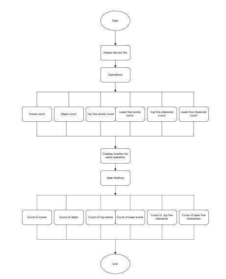

Here 1st task is to count vowels from the text file:
The class reads the text file, the loop goes through each line of the file and checks for each character if it matches with the character then counts its occurance and prints the count.

2nd task is to count the digits from text file:
The class reads the text file, the loop goes through each line of the file and checks for each digit if it matches with the digit then counts its occurance and prints the count.

3rd task it to count top 5 words used:
The class reads the text file, HashMap counts the occurrance of each word. The main loop goes through each line, using HashMap program finds the word which is occurring many times and gives the count.

4th task is to count the least words used:
The class reads the text file, HashMap counts the occurrance of each word. The main loop goes through each line, using HashMap program finds the word which is occurring few times and gives the count.

5th task is to find top characters count:
The class reads the text file. Then loops through each character in the file and increments the count of character in charcount array. It again uses loop and finds largest of it and gives the count.

6th task is to find least characters count:
The class reads the text file. Then loops through each character in the file and increments the count of character in charcount array. It again uses loop and finds smallest of it and gives the count.

Output:
Text File Exercise
Number of Vowels:
a count:357
e count:504
i count:360
o count:260
u count:107

Number of Digits:
0 count:0
1 count:0
2 count:0
3 count:0
4 count:0
5 count:0
6 count:0
7 count:0
8 count:0
9 count:0

Count of Top 5 words used:
energy:12
the:23
to:25
of:32
and:34

Count of least 5 words used:
3.6: 1
worldwide,: 1
landscape: 1
treating: 1
warms.: 1

Count of Top Characters used:
e: 502
a: 351
i: 349
n: 334

Count of Least Characters used:
L: 1
4: 2
6: 2
8: 2
E: 2

Optional Question - Top categories

The top categories are:
1. Explained News
2. Political Pulse
3. Latest Opinion
4. Mumbai News
5. Delhi News
6. Pune News
7. Bangalore News
8. Bollywood News
9. Health News
10. India News
11. Sports News
12. Lifestyle News
13. Jobs
14. Mobile &amp; Tabs
15. Tech Reviews
16. Gadgets
17. Mobile &amp; Tabs
18. Food &amp; Wine
19. Elections 2023
20. Fitness

