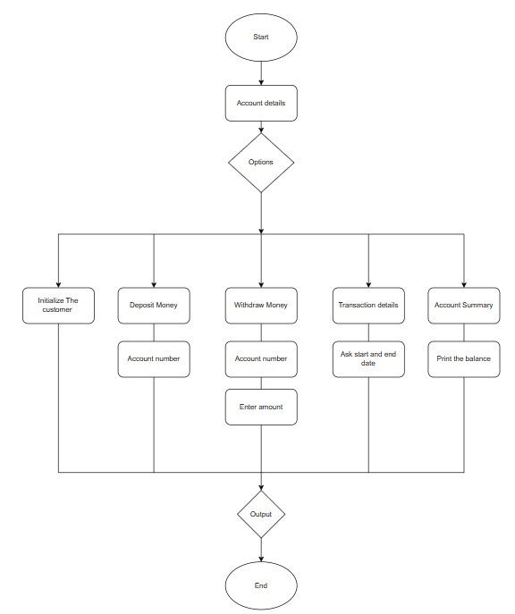

This program is a meanu driven program.
1.First, User will be asked about his bank details.
2.Then options will be asked to perform task which are:
  1. Deposit money
  2. Withdraw Money
  3. Print transaction
  4. Print account summary
3.When he goes for 1 he will be asked for amount to be deposited, here an array is created which stores the date and time of the transaction and the amount deposited.
4.When he goes for 2 he will be asked for amount to be withdrawn, here when the user gives an amount it will get detetected from the main balance and the remaining money will be printed as balance amount. Here also the array will store transaction details and the amount withdrawn.
5.When he goes for 3 it will print transaction details i.e the arrays that has been created for storing transaction details.
6.When he goes for 4 it will print summary of the account i.e the account details and the balance. 

Output:
Enter the Name:
Jeevan
Enter the account number:
22122123
Enter the balance:
1000
Options to Perform
1. Deposit money
2. Withdraw Money
3. Print transaction
4. Print account summary
Enter a option
1
Money deposit
Enter the money u want to deposit
1000
Your balance amount is 2000

Do you want to continue, 'y' or 'n'
y
Options to Perform
1. Deposit money
2. Withdraw Money
3. Print transaction
4. Print account summary
Enter a option
2
Money Withdrawl
Enter the money u want to withdrawl
900
Your balance amount is 1100
Money withdrawn

Do you want to continue, 'y' or 'n'
y
Options to Perform
1. Deposit money
2. Withdraw Money
3. Print transaction
4. Print account summary
Enter a option
3
Transaction
2023-02-22 20:05:07.656 1000 Deposited, Available balance is2000
2023-02-22 20:05:17.931 900 Deposited, Available balance is1100
End of transaction

Do you want to continue, 'y' or 'n'
y
Options to Perform
1. Deposit money
2. Withdraw Money
3. Print transaction
4. Print account summary
Enter a option
4
Account Holder:Jeevan
Account Number:22122123
Balance:1100

Do you want to continue, 'y' or 'n'
n

