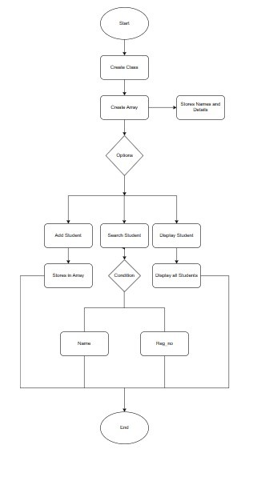

This program is Menu driven Program:
User will be asked for options:
1. Add name
2. Search a Student
3. Display Student Details
When option 1 is choosen an array is been created of max length 100, then name will be added into it.

When option 2 is choosen user will be asked for 2 options:
a. To search using Name
b. To search using Reg_no
When 'a' is choosen it will ask for name for searched, given name is used to search from an array, if it is found it print 'Student found'.
When 'b' is choosen it will ask for Reg_no for searching, given reg_no is used to search from an array, if it is found it print 'Student found'.

When option 3 is choosen it will display all the names stored in array.

Output:
Options
1. Add Name
2. Search a Student
3. Display Student Details
1
Enter a Reg_no:
22122123
Enter a name:
Jeevan Kishore  
Enter a Email:
jeevankishore@gmail.com
Enter Phone Number:
938159834
Enter class:
MscDs
Enter department:
Data Science
Do you want continue?
n
Options
1. Add Name
2. Search a Student
3. Display Student Details
2
How do you want to search a student:
1. Name
2. Reg_no
1
Enter the name u want to search:
Jeevan Kishore
Do you want continue?
n
Options
1. Add Name
2. Search a Student
3. Display Student Details
3
 Student Details
Reg_No: 22122123
Name: Jeevan Kishore
Email: jeevankishore@gmail.com
Phone Number: 938159834
Class: MscDs
Department: Data Science
Do you want continue?
y

